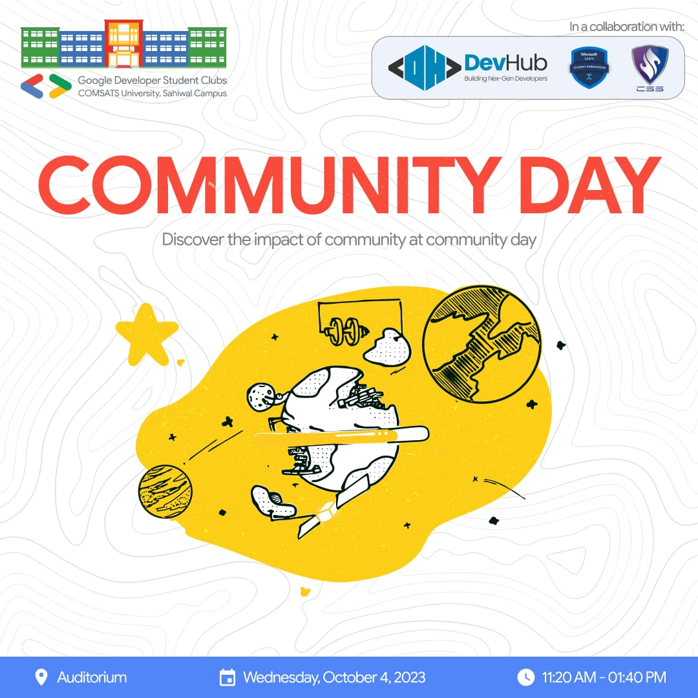

# Google Developer Student Clubs (GDSC) ComDay at COMSATS University, Sahiwal Campus

Welcome to the official GitHub repository for the GDSC ComDay event hosted at COMSATS University, Sahiwal Campus on October 4, 2023. This repository contains information and resources related to the event, including key takeaways and additional tips for university students.

## Event Overview

The Google Developer Student Clubs (GDSC) at COMSATS University, Sahiwal Campus organized the ComDay event to introduce university freshmen to the tech community and provide insights into current technologies, career opportunities, and skill development. The event aimed to support students, offer valuable resources, and provide unique growth opportunities.

### Event Activities

The event featured a variety of activities, including:

1. **GDSC Info Session by Nabeel Ahmed:** Students learned about the GDSC program and how to get involved.

2. **GitHub for Students and Hacktoberfest by Abdul Raheem and Hasham:** Students learned the basics of using GitHub and how to participate in Hacktoberfest, a month-long celebration of open source software.

3. **Algorithm of Success by Muhammad Jamil:** Students learned about the strategies, and Do's and Don't to ace their University life

### Giveaways and Incentives

Participants had the chance to win exciting giveaways, swag items, and incentives, including:

- Incentives
- Stickers
- Gift cards from Google and other sponsors

## Event Success

ComDay was a tremendous success, with over 100 students in attendance. Participants appreciated the opportunity to:

- Learn about new technologies
- Network with other students and professionals
- Get involved in the tech community

## Key Takeaways from the Algorithm of Success Workshop

During the "Algorithm of Success" workshop by Muhammad Jamil, participants learned valuable strategies for achieving academic and career success. Here are the key takeaways:

1. **Set SMART Goals:** Define Specific, Measurable, Achievable, Relevant, and Time-bound goals to stay focused and motivated.

2. **Create a Study Schedule:** Organize your study time effectively by creating a schedule that allocates time for different subjects and tasks.

3. **Use Active Learning Techniques:** Engage actively with your study materials through practices like summarizing, teaching others, or solving problems.

4. **Find a Study Buddy or Group:** Collaborate with peers to enhance your understanding and reinforce learning through discussions and group study sessions.

5. **Take Care of Yourself:** Prioritize self-care, including adequate sleep, healthy eating, and regular exercise, to maintain physical and mental well-being.

## Additional Tips for University Students

Here are some additional tips for university students to excel in their studies and future careers:

- **Get to Know Your Professors:** Establish a good relationship with your professors for academic guidance and networking opportunities.

- **Use Campus Resources:** Explore the campus library and other available resources to enhance your learning experience.

- **Get Involved in Extracurricular Activities:** Join clubs, societies, or extracurricular activities that align with your interests and career goals to broaden your horizons.

Feel free to explore this repository for more information and resources related to the GDSC ComDay event. If you have any questions or suggestions, please don't hesitate to reach out to us. Thank you for being a part of this exciting event! 🚀
